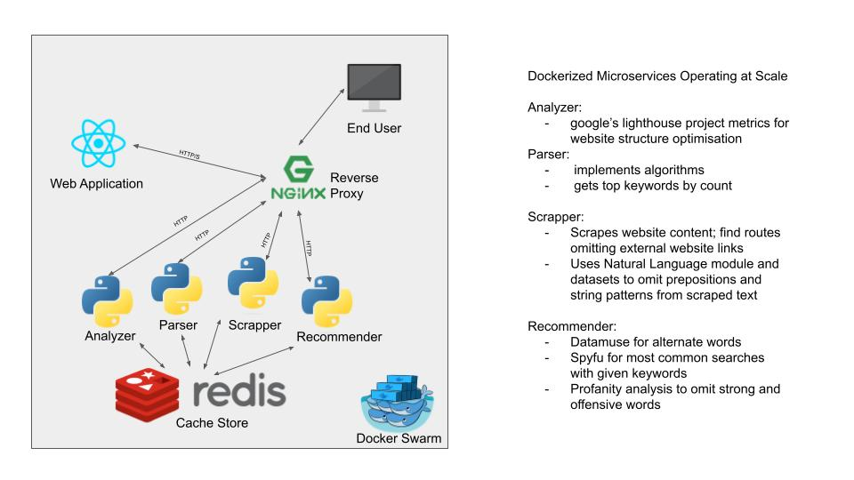
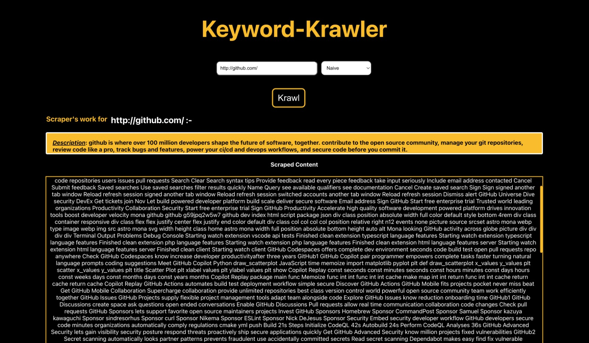
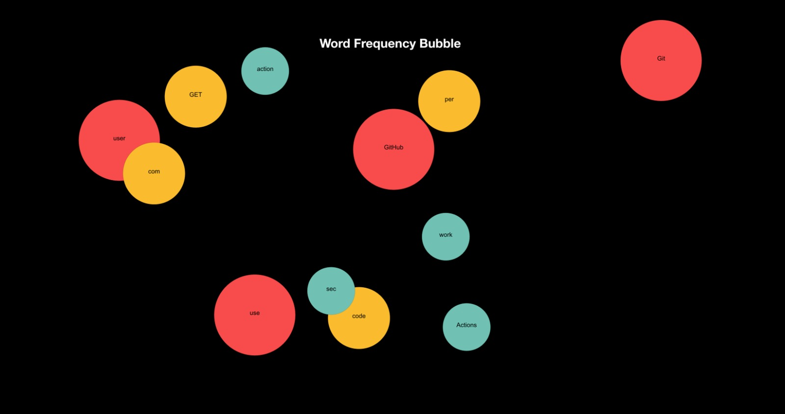
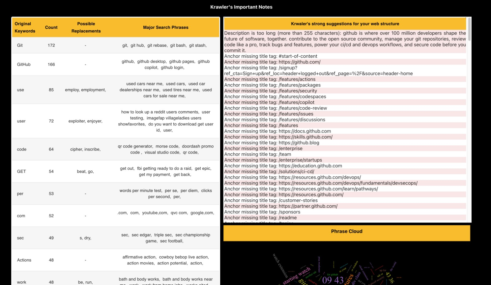
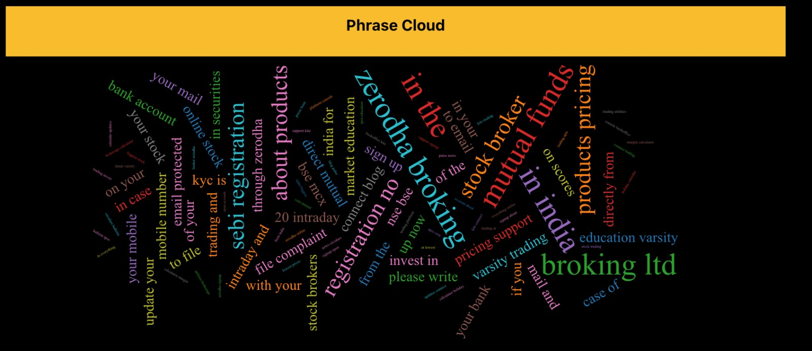
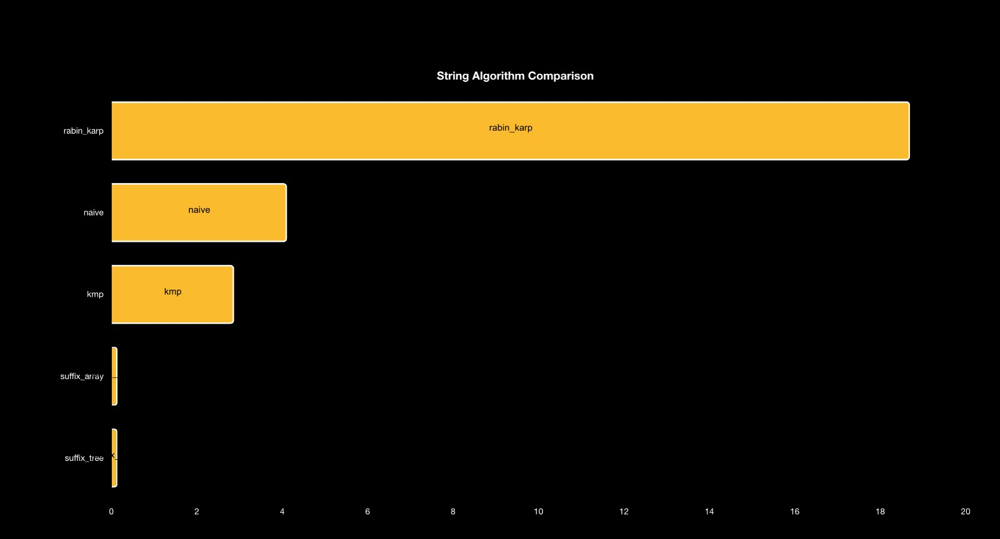

# Keyword-Krawler
SEO Boosting Keyword Scraper

## Description
Designed a tool that aids end users in finding the top-ranking keywords on any particular website, providing insights and suggestions to optimize the content for better SEO rank. Implemented suffix arrays for split-second response times for scalable stateless cache-enabled microservices.

## To Run
`docker-compose up`

[Project Video Link](https://youtu.be/mxHsv5bLat4)

##System Architecture

## UI Screenshots

